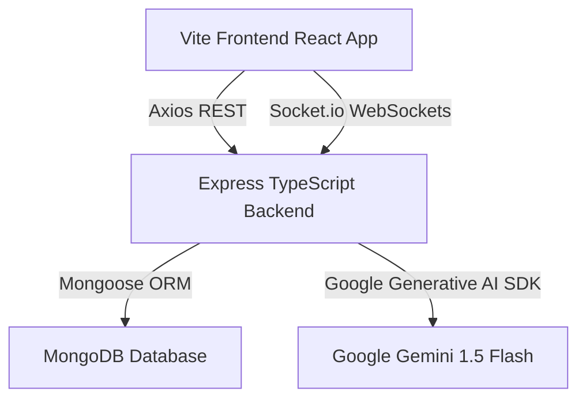

# esparkPM – Enterprise Project Management System with Gemini AI

esparkPM is a MERN-stack enterprise-grade Project Management System (PMS) tailored for agency workflows, sprint telemetry, and developer productivity. Powered by **Google Gemini AI**, esparkPM features automatic standup synthesis, real-time workload risk metrics, AI developer tools, and intelligent semantic workspace search.

---

## 📸 Dashboard Interface


---

## 🚀 Key Features

### 🧠 Google Gemini AI Integrations
- **AI-Generated Daily Standups**: Automatically synthesizes standup reports for developers containing yesterday's completed tasks, today's focus, blocker logs, and sprint impact analysis.
- **AI Productivity & Risk Insights**: Displays real-time **Sprint Health Score** telemetry, overdue task delay reason analysis, risk mitigations, and workload balancing assessments.
- **AI Developer Assistant**: Multi-tab workspace assistant inside the task detail view offering code explanation, refactoring hints, and sub-task breakdown guidelines.
- **AI Smart Search**: Semantic workspace search allowing developers to search through tasks and chat logs using natural language.
- **AI Operational Notification Intelligence**: Scans tasks and workloads to flag bottleneck warnings and team imbalances directly in the notification drawer.
- **Task Requirement Auto-Spec**: Generates detailed functional requirements, edge cases, and acceptance criteria on the fly.

### 📅 Sprint & Project Tracking
- **Interactive Kanban Boards**: Drag-and-drop workflow status updates with task details, priority levels, and member assignments.
- **Time Tracking & Logs**: Start, stop, and pause active work timers. Automated dashboard timeline visualizations.
- **Inbox & Activity Feed**: Unified communication channel with WebSockets for real-time alerts.

---

## 🛠️ Tech Stack

| Layer | Technologies Used |
|---|---|
| **Frontend** | React 18, Vite, TailwindCSS (harmonious slate-dark theme), Zustand (state management), Lucide Icons, Recharts |
| **Backend** | Node.js, Express, TypeScript, MongoDB, Mongoose ODM, Socket.io, `@google/generative-ai` SDK |
| **Tooling** | `tsx` watch, ES Modules, TypeScript compiled checking, Memory Cache wrapper |

---

## 📂 Architecture & Development Journey

esparkPM was developed with clean-architecture principles and scalability in mind:



### 1. Backend Design System
- **Repository Pattern**: Decouples database queries (Mongoose models) from route controller logic for easier unit testing.
- **Resilient AI Service Layer**: Centralized `geminiService.ts` wrapping the generative SDK. Implements:
  - **Rate-limit retries**: Automatically retries on rate limits with exponential backoff.
  - **Cache layer**: Map-based TTL cache helper to reduce query duplication and API cost.
  - **JSON Mode**: Forces Gemini to output strict, parsing-safe JSON formats.
  - **Fail-safe fallback**: Graceful mock schema injector in case of API outages or missing environment credentials.

### 2. Frontend Layout & Theme
- **Glassmorphic Surface Design**: Consistent tokens utilizing custom HSL color values for rich background blurs, subtle glowing states, and responsive layouts.
- **Zustand Store Architecture**: Segmented state management for Auth, Notifications, Time Logs, and Projects.

---

## ⚙️ Installation & Setup

### Prerequisites
- Node.js (v18+)
- MongoDB running locally or on MongoDB Atlas

### 1. Backend Setup
1. Navigate to the backend directory:
   ```bash
   cd backend
   ```
2. Install dependencies:
   ```bash
   npm install
   ```
3. Create a `.env` file in the `backend/` directory:
   ```env
   PORT=5000
   MONGODB_URI=your_mongodb_connection_uri
   JWT_SECRET=your_jwt_signing_key
   GEMINI_API_KEY=your_google_gemini_api_key
   GEMINI_MODEL=gemini-1.5-flash
   ```
4. Seed the database with the Super Admin user:
   ```bash
   npm run seed
   ```
5. Launch the backend server:
   ```bash
   npm run dev
   ```

### 2. Frontend Setup
1. Navigate to the frontend directory:
   ```bash
   cd ../frontend
   ```
2. Install dependencies:
   ```bash
   npm install
   ```
3. Create a `.env` file in the `frontend/` directory:
   ```env
   VITE_API_URL=http://localhost:5000/api
   ```
4. Start the frontend Vite dev server:
   ```bash
   npm run dev
   ```
5. Open your browser and navigate to `http://localhost:5173`.
