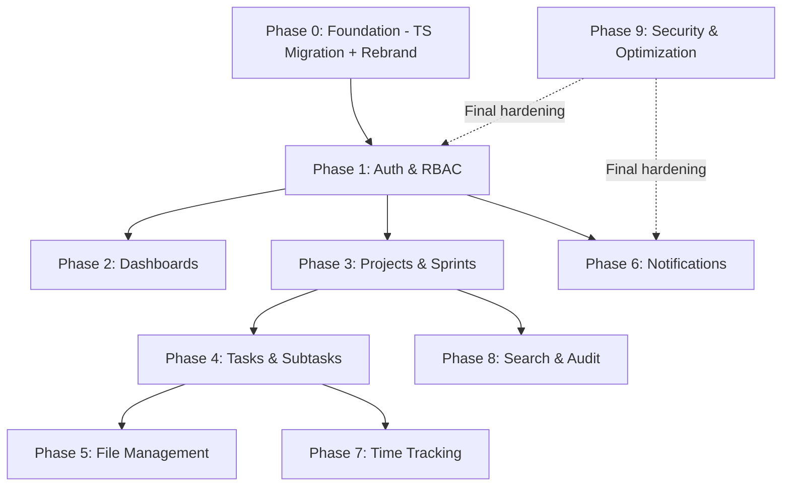

# esparkPM — Enterprise PMS Upgrade: Full Implementation Plan

## Overview

Upgrade the existing MERN PMS (aeroPM) into **esparkPM** — an enterprise-grade, fully TypeScript platform with 9 feature phases, WCAG-AA accessible design, and a complete rebrand.

---

## 🚨 User Review Required

> [!NOTE]
> ✅ **Storage**: Local disk storage + MongoDB GridFS metadata (no Cloudinary/S3). Max 10MB per file.

> [!NOTE]
> ✅ **Email**: Nodemailer + SMTP.

> [!NOTE]
> ✅ **Redis**: User will install Redis locally.

> [!NOTE]
> ✅ **Timezone**: IST (UTC+5:30) — stored as UTC in DB, displayed in IST.

> [!NOTE]
> ✅ **Roles**: `Project Manager` role is kept as-is. `Team Lead / BA` maps to `Admin`.

> [!NOTE]
> ✅ **Routing**: Upgrading to `react-router-dom v6` with proper URL paths.

> [!NOTE]
> ✅ **Logo**: Auto-generated for esparkPM brand.

> [!WARNING]
> **TypeScript Migration**: All 14 backend models + 16 route files + all frontend `.jsx` → `.tsx` files will be converted. This is a breaking rename. Confirm before execution so existing dev work is not disrupted mid-migration.

> [!CAUTION]
> **No Public Registration**: Only Super Admin can create users. An initial **seed script** will be provided to bootstrap the first Super Admin account.

---

## ✅ All Questions Resolved — Execution Approved

---

## Pre-Phase 0 — Foundation (Do First, Blocks Everything)

### TypeScript Migration (Backend)
- Convert `server.js` → `server.ts`
- Convert `src/app.js` → `src/app.ts`
- Add `tsconfig.json` with `esModuleInterop`, `strict`, `moduleResolution: node16`
- Add `tsx`, `@types/express`, `@types/mongoose`, `@types/bcryptjs`, `@types/jsonwebtoken`, `@types/node` as devDependencies
- Replace `nodemon` with `ts-node-dev` or `tsx watch`
- Convert all 14 models → `.ts` with typed interfaces (e.g. `IUser`, `ITask`)
- Convert all 16 route files, 3 middleware files, controllers, repositories, services → `.ts`

### TypeScript Migration (Frontend)
- Add `typescript`, `@types/react`, `@types/react-dom` to devDependencies
- Rename `vite.config.js` → `vite.config.ts`
- Rename `tailwind.config.js` → `tailwind.config.ts`
- Convert `src/main.jsx` → `src/main.tsx`
- Convert `src/App.jsx` → `src/App.tsx`
- Convert all feature components `.jsx` → `.tsx` (batch rename)
- Add global type definitions file `src/types/index.ts`

### esparkPM Rebrand
- Update `package.json` `name` fields in both backend and frontend
- Update `<title>` in `index.html`
- Update all string occurrences of `aeroPM` / `AeroPM` → `esparkPM`
- Update `DashboardLayout.tsx` sidebar logo/brand name

### Accessibility-First Color Theme
Replace current violet/slate palette with WCAG-AA compliant esparkPM palette:

| Token | Value | Usage |
|---|---|---|
| `--espark-primary` | `#2563EB` (Blue 600) | CTA, links, active states |
| `--espark-primary-dark` | `#1D4ED8` | Hover states |
| `--espark-secondary` | `#0EA5E9` (Sky 500) | Highlights, badges |
| `--espark-success` | `#16A34A` (Green 600) | Done, approved |
| `--espark-warning` | `#D97706` (Amber 600) | In progress, due soon |
| `--espark-danger` | `#DC2626` (Red 600) | Overdue, blocked |
| `--espark-bg` | `#0F172A` (Slate 950) | App background |
| `--espark-surface` | `#1E293B` (Slate 800) | Cards, panels |
| `--espark-border` | `#334155` (Slate 700) | Borders |
| `--espark-text` | `#F1F5F9` (Slate 100) | Body text |
| `--espark-muted` | `#94A3B8` (Slate 400) | Secondary text |

All foreground/background combos meet **4.5:1 contrast ratio** (WCAG AA).

---

## Phase 1 — Enterprise Authentication & User Management

> **Estimated subtasks: 24**

### New Database Collections

#### [MODIFY] `models/user.ts`
Add: `refreshTokens[]`, `passwordResetToken`, `passwordResetExpires`, `passwordChangedAt`, `loginAttempts`, `lockUntil`, `metadata` (phone, position, bio)

#### [NEW] `models/session.ts`
```
sessions: { userId, refreshToken (hashed), deviceInfo, ipAddress, userAgent, lastActive, expiresAt, isRevoked }
```

#### [NEW] `models/loginHistory.ts`
```
login_history: { userId, ipAddress, userAgent, device, browser, os, status (success/failed), timestamp, location }
```

#### [NEW] `models/auditLog.ts`
```
audit_logs: { userId, action, resource, resourceId, oldValue, newValue, ipAddress, timestamp, severity }
```

#### [NEW] `models/role.ts`
```
roles: { name, slug, permissions[], description, isSystem, createdBy }
```
Seed roles: `super_admin`, `admin`, `team_lead`, `developer`, `designer`, `ui_ux`, `qa`

### Authentication Architecture

#### [MODIFY] `utils/jwt.ts`
- `generateAccessToken(userId, role)` → 15min expiry
- `generateRefreshToken(userId)` → 7d or 30d (remember me)
- `verifyAccessToken(token)`
- `verifyRefreshToken(token)`

#### [MODIFY] `controllers/authController.ts`
- `login` — issue access + refresh tokens, set HTTP-only cookies, log login history, record session
- `refreshToken` — validate refresh cookie → issue new access token
- `logout` — revoke session, clear cookies
- `logoutAllDevices` — revoke all sessions for user
- `forgotPassword` — generate reset token, send email
- `resetPassword` — validate token, update password, revoke all sessions
- `getActiveSessions` — list all active device sessions
- `revokeSession(sessionId)` — revoke specific session

#### [MODIFY] `middlewares/authMiddleware.ts`
- `protect` — read from HTTP-only cookie OR `Authorization: Bearer`
- `restrictTo(...roles)` — RBAC guard
- `auditLog(action)` — middleware to write to audit_logs
- `trackDevice` — attach parsed device/IP info to req

### User Management (Super Admin Only)

#### [MODIFY] `controllers/userController.ts`
- `createUser` — Super Admin only, assign role, send welcome email with temp password
- `updateUser` — update role, department, metadata
- `deactivateUser` — set `isActive: false`, revoke all sessions
- `activateUser` — re-enable account
- `resetUserPassword` — admin-triggered reset
- `getUserSessions` — view all sessions
- `getLoginHistory` — paginated login history per user
- `getAuditLogs` — paginated audit log

### API Routes — Phase 1

```
POST   /api/v1/auth/login
POST   /api/v1/auth/logout
POST   /api/v1/auth/logout-all
POST   /api/v1/auth/refresh-token
POST   /api/v1/auth/forgot-password
POST   /api/v1/auth/reset-password/:token
GET    /api/v1/auth/sessions
DELETE /api/v1/auth/sessions/:sessionId

POST   /api/v1/users                    (Super Admin)
GET    /api/v1/users
GET    /api/v1/users/:id
PATCH  /api/v1/users/:id
PATCH  /api/v1/users/:id/activate
PATCH  /api/v1/users/:id/deactivate
GET    /api/v1/users/:id/sessions
GET    /api/v1/users/:id/login-history

GET    /api/v1/audit-logs               (Super Admin / Admin)
```

### Frontend Auth Flow

#### [MODIFY] `store/useAuthStore.ts`
- State: `user`, `isAuthenticated`, `loading`, `activeSessions`
- Actions: `login`, `logout`, `logoutAll`, `refreshToken`, `checkAuth` (silent refresh on load)
- Add `rememberMe` flag → passes to backend → controls refresh token expiry

#### [NEW] `features/auth/LoginPage.tsx`
- esparkPM branded login page
- Email + password fields
- "Remember Me" checkbox
- Forgot password link
- Error states with accessible ARIA labels

#### [NEW] `features/auth/ForgotPassword.tsx`
#### [NEW] `features/auth/ResetPassword.tsx`
#### [NEW] `features/admin/SessionManagement.tsx`
- Active sessions list with device icon, IP, last active
- Revoke single session / revoke all

#### [MODIFY] `components/ProtectedRoute.tsx`
- Role-array based guard
- Redirect with `returnTo` URL preserved
- Suspended/deactivated account screen

---

## Phase 2 — Role-Based Dashboards & Team Management

> **Estimated subtasks: 18**

### Dashboard Architecture

#### [NEW] `features/dashboard/DashboardRouter.tsx`
- Reads `user.role` from auth store
- Renders correct dashboard: `SuperAdminDashboard`, `AdminDashboard`, `DeveloperDashboard`

#### [NEW] `features/dashboard/SuperAdminDashboard.tsx`
Widgets: Company KPIs, Team Productivity Chart, Active Projects grid, Team Workload heatmap, Delayed Projects, Audit Log feed, AI Insights card

#### [NEW] `features/dashboard/AdminDashboard.tsx`
Widgets: Sprint progress, Team workload bar, Pending approvals, Project progress circles, Sprint velocity

#### [NEW] `features/dashboard/DeveloperDashboard.tsx`
Widgets: My Tasks (today/week), Due Tasks countdown, Timer widget, Linked project status, Notification feed, Recent activity

### Reusable Widget System

#### [NEW] `features/dashboard/widgets/` directory
- `StatsCard.tsx` — metric + delta + icon
- `ProgressRing.tsx` — circular progress
- `WorkloadBar.tsx` — per-person capacity bar
- `ActivityFeed.tsx` — paginated log
- `ChartCard.tsx` — wraps Recharts with consistent styling
- `TeamPerformanceTable.tsx`

### Team Grouping System

#### [NEW] `models/department.ts`
```
departments: { name, slug, head (userId), members[], createdAt }
```

#### [MODIFY] `models/team.ts`
Add: `department`, `capacity`, `performanceScore`, `workloadPercentage`

### API Routes — Phase 2
```
GET /api/v1/dashboard/stats           (role-filtered)
GET /api/v1/dashboard/team-workload
GET /api/v1/dashboard/project-summary
GET /api/v1/dashboard/productivity    (Super Admin)
GET /api/v1/departments
POST /api/v1/departments
PATCH /api/v1/departments/:id
```

---

## Phase 3 — Advanced Project Management & Sprint System

> **Estimated subtasks: 20**

### Project Schema Upgrades

#### [MODIFY] `models/project.ts`
Add: `sprints[]`, `milestones[]`, `budget` (hours), `timeline` (start/end), `velocity`, `tags[]`, `views` (kanban/list/timeline/calendar)

#### [NEW] `models/sprint.ts`
```
sprints: { project, name, goal, startDate, endDate, status (planning/active/completed/cancelled), tasks[], velocity, capacity, burndownData[] }
```

### Project Workspace Structure
Each project gets sub-routes/tabs:
- Overview, Team, Sprint Board, Tasks, Timeline, Reports, Activity, Attachments, Communication

#### [NEW] `features/projects/ProjectWorkspace.tsx` — tabbed container
#### [NEW] `features/projects/views/KanbanView.tsx`
#### [NEW] `features/projects/views/ListView.tsx`
#### [NEW] `features/projects/views/TimelineView.tsx` (Gantt-style)
#### [NEW] `features/projects/views/CalendarView.tsx`
#### [NEW] `features/projects/SprintBoard.tsx`
#### [NEW] `features/projects/MilestoneTracker.tsx`

### API Routes — Phase 3
```
GET/POST   /api/v1/projects/:id/sprints
PATCH      /api/v1/projects/:id/sprints/:sprintId
POST       /api/v1/projects/:id/sprints/:sprintId/start
POST       /api/v1/projects/:id/sprints/:sprintId/complete
GET        /api/v1/projects/:id/timeline
GET        /api/v1/projects/:id/reports
GET        /api/v1/projects/:id/velocity
```

---

## Phase 4 — Enterprise Task & Subtask System

> **Estimated subtasks: 22**

### Task Schema Upgrades

#### [MODIFY] `models/task.ts`
Add: `sprint`, `estimatedHours`, `loggedHours`, `acceptanceCriteria[]`, `techNotes`, `qaChecklist[]`, `deploymentNotes`, `requirementNotes`, `dependencies[]` (taskIds), `hierarchy` (parent/child), `breadcrumb`, `richDescription` (delta/HTML), `tags[]`, `watchers[]`

#### [MODIFY] `models/subtask.ts`
Upgrade to full mini-task schema with: own `assignee`, `status`, `dueDate`, `estimatedHours`, `loggedHours`, `attachments[]`, `comments[]`, `activityHistory[]`, `communications[]`

### Task Workspace

#### [MODIFY] `features/tasks/TaskDetailView.tsx`
Tabs: Details, Subtasks, Comments, Files, Activity, Time Log, Communication

#### [NEW] `features/tasks/SubtaskDetailView.tsx`
Full sub-page with all above tabs, breadcrumb: `Project > Task > Subtask`

#### [NEW] `features/tasks/components/TaskDependencyGraph.tsx`
#### [NEW] `features/tasks/components/ActivityTimeline.tsx`
#### [NEW] `features/tasks/components/QAChecklist.tsx`
#### [NEW] `features/tasks/components/AcceptanceCriteria.tsx`
#### [NEW] `features/tasks/components/BreadcrumbNav.tsx`

### API Routes — Phase 4
```
GET/POST   /api/v1/tasks/:id/subtasks
PATCH      /api/v1/subtasks/:id
GET        /api/v1/tasks/:id/dependencies
POST       /api/v1/tasks/:id/dependencies
GET        /api/v1/tasks/:id/activity
GET        /api/v1/tasks/:id/time-logs
```

---

## Phase 5 — File & Attachment Management

> **Estimated subtasks: 14**

### Storage: Cloudinary (default)

#### [NEW] `config/cloudinary.ts`
#### [NEW] `middlewares/uploadMiddleware.ts` — multer + cloudinary stream
#### [NEW] `models/attachment.ts` (upgrade existing)
Add: `version`, `versionHistory[]`, `checksum`, `mimeType`, `thumbnailUrl`, `previewUrl`, `permissions`, `attachedTo` (polymorphic: project/task/subtask/comment/communication)

#### [NEW] `controllers/attachmentController.ts`
- `uploadFiles` — multi-file, validates type/size, generates thumbnail
- `getFileVersions`
- `downloadFile` — signed URL
- `deleteFile` — soft delete + Cloudinary cleanup
- `addFileComment`

#### [NEW] `features/files/FileUploadZone.tsx` — drag/drop
#### [NEW] `features/files/FilePreviewModal.tsx` — image/PDF/video preview
#### [NEW] `features/files/FileVersionHistory.tsx`

### API Routes — Phase 5
```
POST   /api/v1/attachments/upload
GET    /api/v1/attachments/:id
DELETE /api/v1/attachments/:id
GET    /api/v1/attachments/:id/versions
POST   /api/v1/attachments/:id/comments
```

---

## Phase 6 — Real-Time Notification System

> **Estimated subtasks: 16**

### Socket.IO Architecture

#### [MODIFY] `socket/socketService.ts`
- Authenticate socket via HTTP-only cookie on connection
- User joins room by `userId`
- Admin joins room by `role`
- Handle reconnection with `lastSeenAt` sync

#### [NEW] `models/notification.ts` (upgrade existing)
Add: `groupKey`, `channel[]` (inApp/email/push), `readAt`, `actionUrl`, `metadata`

#### [NEW] `services/notificationService.ts`
- `emit(userId, event, payload)` — Socket.IO emit
- `sendEmail(userId, template, data)` — Nodemailer
- `createNotification(data)` — persist + emit

#### [NEW] `features/notifications/NotificationCenter.tsx`
- Bell icon with unread badge
- Grouped notification list
- Read/unread toggle
- Mark all read

#### Notification Events (Socket.IO)
```
task:assigned, task:updated, task:commented,
task:overdue, task:status_changed,
file:uploaded, sprint:updated,
mention:created, communication:updated
```

### API Routes — Phase 6
```
GET    /api/v1/notifications
PATCH  /api/v1/notifications/:id/read
PATCH  /api/v1/notifications/read-all
DELETE /api/v1/notifications/:id
GET    /api/v1/notifications/preferences
PATCH  /api/v1/notifications/preferences
```

---

## Phase 7 — Time Tracking & Productivity

> **Estimated subtasks: 14**

### Timer System

#### [MODIFY] `models/timeLog.ts`
Add: `sessionStart`, `sessionEnd`, `idleTime`, `isBillable`, `notes`, `source` (manual/timer), `productivity` (score)

#### [NEW] `services/timerService.ts`
- Start/stop/pause timer
- Auto-detect idle (frontend heartbeat)
- Sync active timer on reconnect

#### [NEW] `features/timeTracking/TimerWidget.tsx` — global floating timer
#### [NEW] `features/timeTracking/WorkLogSheet.tsx` — daily manual log
#### [NEW] `features/timeTracking/TimeReports.tsx` — weekly/monthly charts

### API Routes — Phase 7
```
POST   /api/v1/time-logs/start
POST   /api/v1/time-logs/stop
POST   /api/v1/time-logs/manual
GET    /api/v1/time-logs/my
GET    /api/v1/time-logs/reports/team
GET    /api/v1/time-logs/reports/project/:id
GET    /api/v1/time-logs/capacity
```

---

## Phase 8 — Global Search, Filters & Audit Logs

> **Estimated subtasks: 12**

### Search Architecture

#### [NEW] `controllers/searchController.ts`
- Aggregation pipeline across: projects, tasks, subtasks, comments, files, users
- Full-text index on `name`, `description`, `content` fields
- Filter by: status, priority, sprint, assignee, dueDate, tags, project

#### MongoDB Indexes to Add
```ts
// task.ts model
taskSchema.index({ name: 'text', description: 'text' });
taskSchema.index({ status: 1, priority: 1, assignees: 1 });
taskSchema.index({ project: 1, sprint: 1, dueDate: 1 });
// Similarly for project, comment, attachment models
```

#### [NEW] `features/search/GlobalSearch.tsx`
- `Cmd+K` shortcut
- Debounced live search
- Result groups by type
- Recent searches (localStorage)

#### [NEW] `features/admin/AuditLogs.tsx`
- Filterable table: user, action, date range, resource
- Export to CSV

### API Routes — Phase 8
```
GET /api/v1/search?q=&type=&project=&status=&assignee=
GET /api/v1/audit-logs?userId=&action=&from=&to=
```

---

## Phase 9 — Security Hardening & Production Optimization

> **Estimated subtasks: 12**

### Security Additions

#### [MODIFY] `src/app.ts`
Add: `helmet()`, `mongoSanitize()`, `xss-clean`, `hpp`, `compression`, `express-rate-limit` (global + auth-specific)

#### [NEW] `middlewares/rateLimiter.ts`
- Auth routes: 5 req / 15 min
- API routes: 100 req / 15 min
- File upload: 10 req / 1 min

#### [NEW] `middlewares/csrfMiddleware.ts` (double-submit cookie pattern)

#### [MODIFY] `middlewares/uploadMiddleware.ts`
- Validate file magic bytes (not just extension)
- Quarantine zone before Cloudinary upload
- Block executable extensions

### Redis Caching

#### [NEW] `config/redis.ts`
- Cache: user sessions, dashboard stats, project lists
- TTL: 5 min for stats, 1 min for active data

#### [NEW] `services/cacheService.ts`
- `get(key)`, `set(key, value, ttl)`, `invalidate(pattern)`

### Production Optimizations
- Add pagination middleware `src/middlewares/paginate.ts`
- Add API response compression
- Frontend: lazy-load all route components (`React.lazy + Suspense`)
- Frontend: image optimization via Cloudinary transformations
- Add `vite.config.ts` build optimizations (chunking, tree shaking)

---

## Implementation Order & Dependencies



---

## Subtask Count Summary

| Phase | Subtasks | Blocks |
|---|---|---|
| Phase 0 (Foundation) | 18 | All phases |
| Phase 1 (Auth) | 24 | Phase 2, 6 |
| Phase 2 (Dashboards) | 18 | None |
| Phase 3 (Projects/Sprints) | 20 | Phase 4, 7, 8 |
| Phase 4 (Tasks) | 22 | Phase 5, 7 |
| Phase 5 (Files) | 14 | — |
| Phase 6 (Notifications) | 16 | — |
| Phase 7 (Time Tracking) | 14 | — |
| Phase 8 (Search/Audit) | 12 | — |
| Phase 9 (Security) | 12 | — |
| **Total** | **170** | — |

---

## Verification Plan

### Automated
- `tsc --noEmit` — type-check both backend and frontend after migration
- `npm run dev` — confirm hot reload works on both after TS setup
- API smoke tests via curl/Postman for each phase's routes

### Manual Verification
- Login flow: JWT cookie in DevTools → `httpOnly` flag confirmed
- Refresh token: expire access token, confirm silent refresh
- RBAC: test each role can only access permitted routes
- Dashboard: confirm different dashboard renders per role
- File upload: drag/drop, confirm Cloudinary URL returned
- Real-time: open two tabs, assign task in one, confirm notification in other
- Accessibility: run axe/WAVE on all pages for WCAG AA
